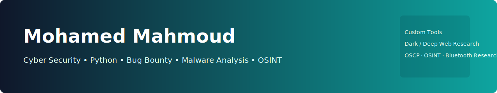

<!-- Banner -->

  

# 👋 Hi — I'm Mohamed Mahmoud

🔒 **Cyber Security Specialist | Python Developer | Bug Bounty Hunter | Systems Analyst | Advanced Malware Analyst**

  

---

## 💡 About Me
I'm a passionate **Cyber Security** professional with deep interest in vulnerability research, malware analysis and threat intelligence. I research the **dark web** and **deep web** for intelligence and historical context — always under legal and ethical boundaries. I build my own security tools (mainly Python), participate in bug bounty programs, and design frameworks for automated triage and reconnaissance.

I focus on combining systems analysis with practical tooling to speed up research and improve defensive posture.

---

## 🧰 Skills & Tools
**Languages:** Python  
**Domains:** Web & Network Security, Malware Analysis, Systems Analysis, Threat Intelligence, OSINT

**Tools & Frameworks I use / build with:**
- `nmap` — network discovery & scanning  
- `Burp Suite` — web application testing & intercepting  
- `Wireshark` — packet capture & analysis  
- `Bettercap` — MITM / network manipulation (lab-only)  
- `Aircrack-ng` — wireless security testing (authorized tests)  
- Custom Python tooling — recon, triage, parsers, automation  
- Working on Bluetooth security & wireless communications research

> ⚠️ Ethics: All testing, tool development and research is performed in controlled labs or with explicit authorization. I follow responsible disclosure and applicable laws.

---

## 🛠️ Tools I Develop
I build custom Python tools to help with:
- Reconnaissance & authorized data collection  
- Automated static/dynamic malware triage helpers  
- Bug bounty workflow automation (scanners, report templates)  
- OSINT playbooks and parsers

*(Projects listed below — links to repos once added.)*

---

## 🔭 Current Focus & Learning
- Advanced Malware Analysis & automated detection  
- OSCP study material — improving exploitation & post-exploitation skills  
- OSINT frameworks and scalable OSINT tooling  
- Bluetooth & wireless attack surface research (controlled labs)

---

## 🔗 Projects (examples — add links)
- **malware-inspector** — automated static/dynamic triage (WIP)  
- **bounty-automation** — Python scripts for bug bounty triage  
- **osint-kits** — notebooks and playbooks for non-intrusive OSINT  
- **my-tools/** — collection of custom recon and triage scripts

---

## 📊 GitHub Stats
  

*(Replace `MohamedMahmoud` with your GitHub username if different.)*

---

## 📫 Contact
- **Email:** momomomomp37@gmail.com  
- **GitHub:** https://github.com/MohamedMahmoud  
- **LinkedIn:** *(add your LinkedIn URL here if you want it displayed)*

---

## ⚠️ Responsible / Legal Notice
All techniques, tools and references mentioned here are intended for authorized, defensive, or educational use only. Unauthorized access to systems, networks, or data is illegal. I abide by responsible disclosure and ethical research guidelines.

---

## 🇪🇬 نبذة قصيرة بالعربي (مختصر)
أنا **محمد محمود** — متخصص أمن سيبراني ومطوِّر بايثون، شغوف بالبحث في الشبكة المظلمة/العميقة، تحليل البرمجيات الخبيثة، وتصميم أدوات أمنية خاصة. أدرس محتوى OSCP وأعمل على OSINT وأبحاث بلوتوث والاتصالات داخل مختبرات مُسيطر عليها وبإطار قانوني.

---

⭐️ If you want, I can now:
- Replace `MohamedMahmoud` with your real GitHub username throughout (if different).  
- Add direct repo links and project READMEs for each tool you want showcased.  
- Generate badge links for HackerOne / Bugcrowd if you have profiles there.  
- Produce a fully bilingual RTL README (Arabic-first) version.

